# DMWF workflow diagrams

The Mermaid files are the editable source for GitHub rendering. SVGs are offline viewing companions derived from the same node and edge definitions. These diagrams describe logical flow; they do not replace the source CFG statement order. Diagrams 05, 07 and 08 are recommended processes, with 08 explicitly a separate Autodesk concept.

## Managed configuration load

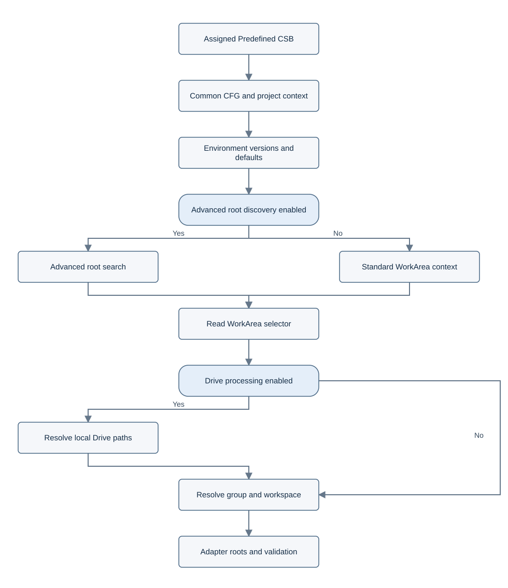

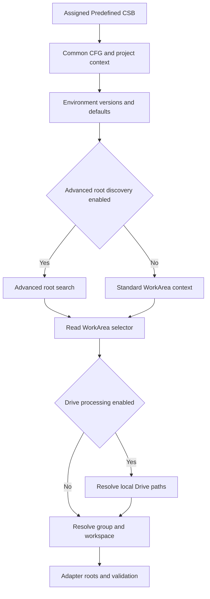
```mermaid
flowchart TD
    A["Assigned Predefined CSB"]
    B["Common CFG and project context"]
    C["Environment versions and defaults"]
    D{"Advanced root discovery enabled"}
    E["Advanced root search"]
    F["Standard WorkArea context"]
    G["Read WorkArea selector"]
    H{"Drive processing enabled"}
    I["Resolve local Drive paths"]
    J["Resolve group and workspace"]
    K["Adapter roots and validation"]
    A --> B
    B --> C
    C --> D
    D -->|Yes| E
    D -->|No| F
    E --> G
    F --> G
    G --> H
    H -->|Yes| I
    H -->|No| J
    I --> J
    J --> K
```

## Workspace and WorkSet selection

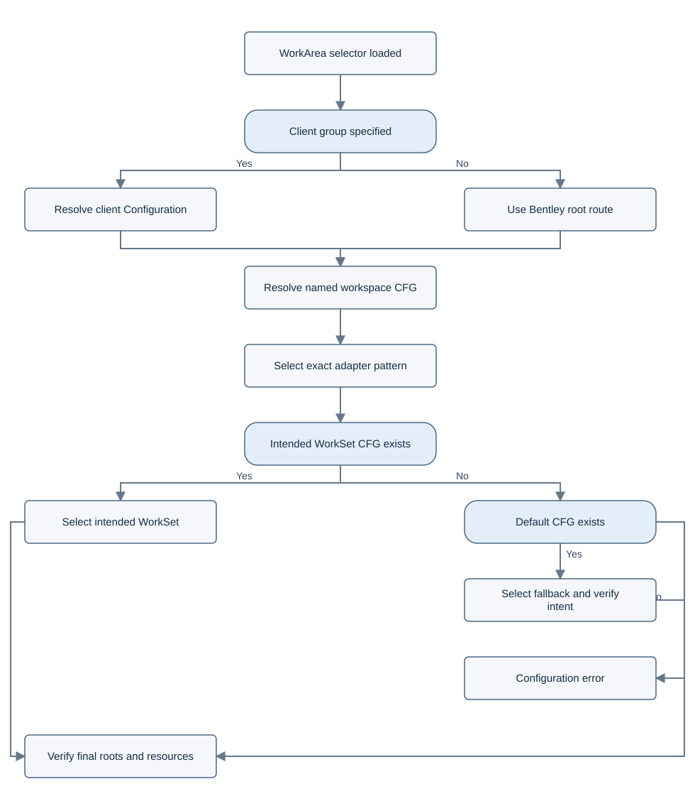

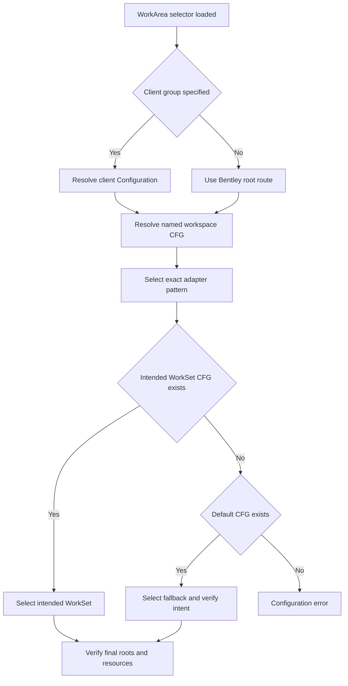
```mermaid
flowchart TD
    A["WorkArea selector loaded"]
    B{"Client group specified"}
    C["Resolve client Configuration"]
    D["Use Bentley root route"]
    E["Resolve named workspace CFG"]
    F["Select exact adapter pattern"]
    G{"Intended WorkSet CFG exists"}
    H["Select intended WorkSet"]
    I{"Default CFG exists"}
    J["Select fallback and verify intent"]
    K["Configuration error"]
    L["Verify final roots and resources"]
    A --> B
    B -->|Yes| C
    B -->|No| D
    C --> E
    D --> E
    E --> F
    F --> G
    G -->|Yes| H
    G -->|No| I
    I -->|Yes| J
    I -->|No| K
    H --> L
    J --> L
```

## Choose a package discovery method

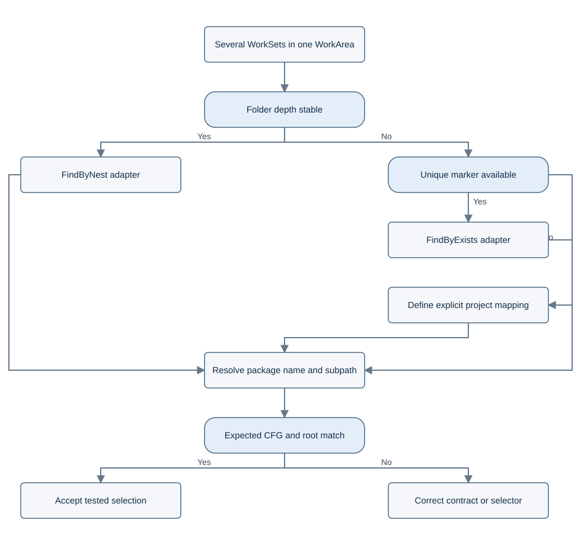

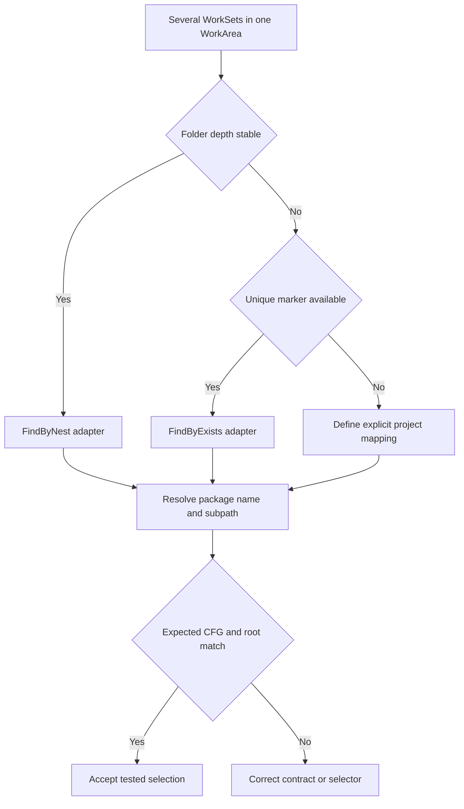
```mermaid
flowchart TD
    A["Several WorkSets in one WorkArea"]
    B{"Folder depth stable"}
    C["FindByNest adapter"]
    D{"Unique marker available"}
    E["FindByExists adapter"]
    F["Define explicit project mapping"]
    G["Resolve package name and subpath"]
    H{"Expected CFG and root match"}
    I["Accept tested selection"]
    J["Correct contract or selector"]
    A --> B
    B -->|Yes| C
    B -->|No| D
    D -->|Yes| E
    D -->|No| F
    C --> G
    E --> G
    F --> G
    G --> H
    H -->|Yes| I
    H -->|No| J
```

## Ancestor configuration inclusion

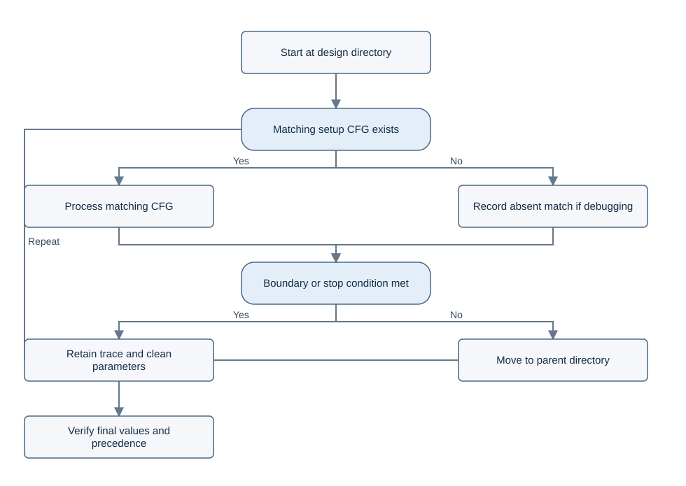

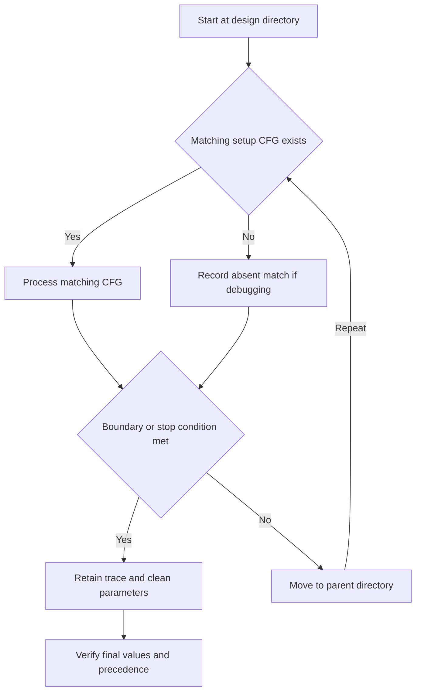
```mermaid
flowchart TD
    A["Start at design directory"]
    B{"Matching setup CFG exists"}
    C["Process matching CFG"]
    D["Record absent match if debugging"]
    E{"Boundary or stop condition met"}
    F["Retain trace and clean parameters"]
    G["Move to parent directory"]
    H["Verify final values and precedence"]
    A --> B
    B -->|Yes| C
    B -->|No| D
    C --> E
    D --> E
    E -->|Yes| F
    E -->|No| G
    G -->|Repeat| B
    F --> H
```

## Release and recovery

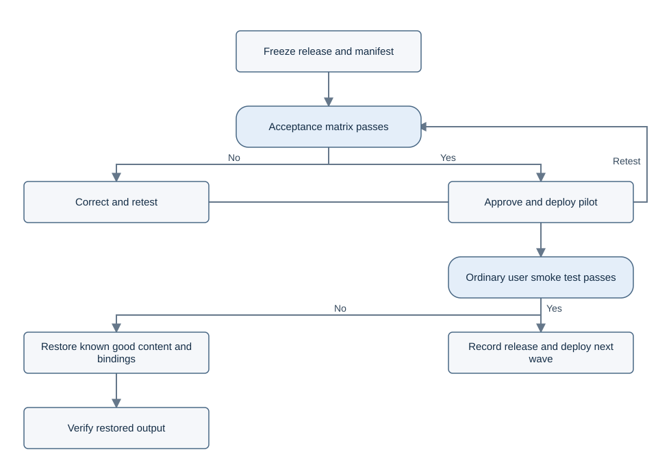

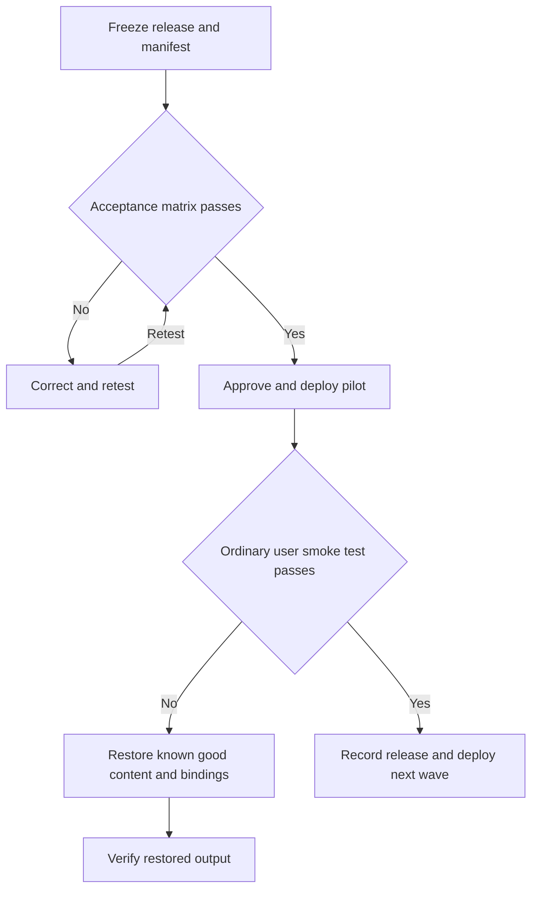
```mermaid
flowchart TD
    A["Freeze release and manifest"]
    B{"Acceptance matrix passes"}
    C["Correct and retest"]
    D["Approve and deploy pilot"]
    E{"Ordinary user smoke test passes"}
    F["Restore known good content and bindings"]
    G["Record release and deploy next wave"]
    H["Verify restored output"]
    A --> B
    B -->|No| C
    C -->|Retest| B
    B -->|Yes| D
    D --> E
    E -->|No| F
    E -->|Yes| G
    F --> H
```

## Diagnose wrong or missing standards

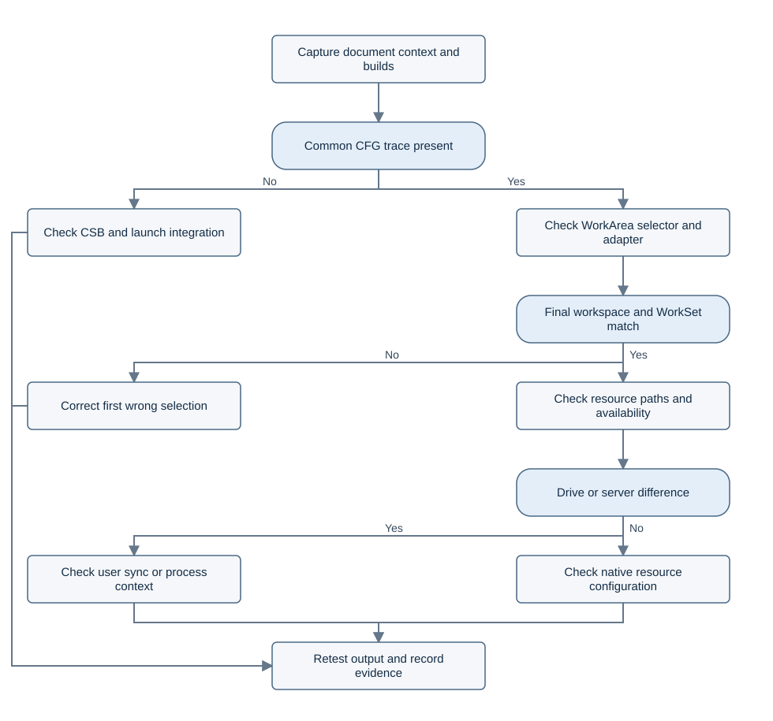

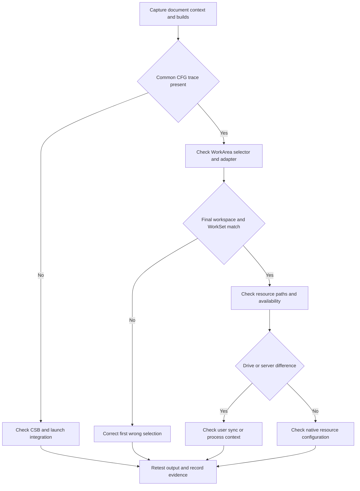
```mermaid
flowchart TD
    A["Capture document context and builds"]
    B{"Common CFG trace present"}
    C["Check CSB and launch integration"]
    D["Check WorkArea selector and adapter"]
    E{"Final workspace and WorkSet match"}
    F["Correct first wrong selection"]
    G["Check resource paths and availability"]
    H{"Drive or server difference"}
    I["Check user sync or process context"]
    J["Check native resource configuration"]
    K["Retest output and record evidence"]
    A --> B
    B -->|No| C
    B -->|Yes| D
    D --> E
    E -->|No| F
    E -->|Yes| G
    G --> H
    H -->|Yes| I
    H -->|No| J
    C --> K
    F --> K
    I --> K
    J --> K
```

## Build a dataset from standards

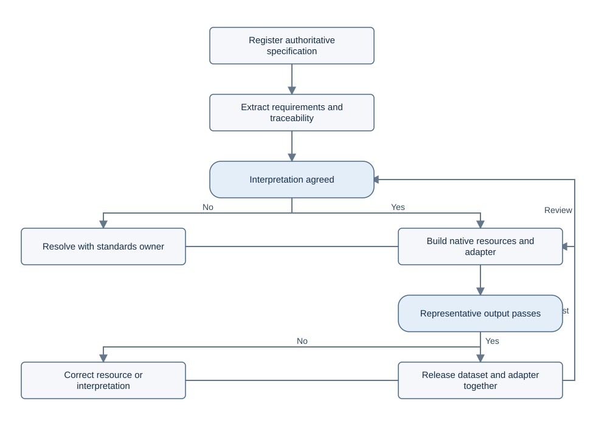

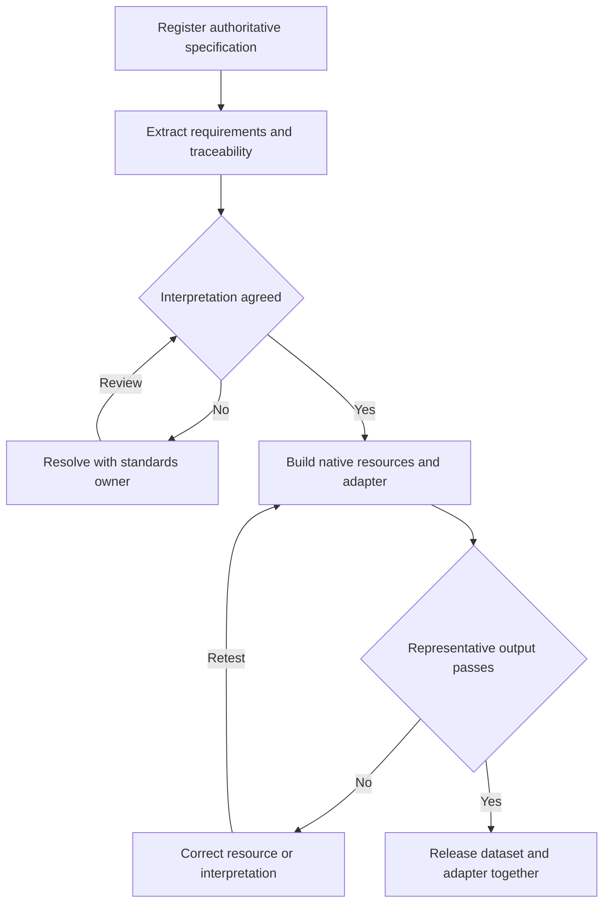
```mermaid
flowchart TD
    A["Register authoritative specification"]
    B["Extract requirements and traceability"]
    C{"Interpretation agreed"}
    D["Resolve with standards owner"]
    E["Build native resources and adapter"]
    F{"Representative output passes"}
    G["Correct resource or interpretation"]
    H["Release dataset and adapter together"]
    A --> B
    B --> C
    C -->|No| D
    D -->|Review| C
    C -->|Yes| E
    E --> F
    F -->|No| G
    G -->|Retest| E
    F -->|Yes| H
```

## Separate Autodesk deployment concept

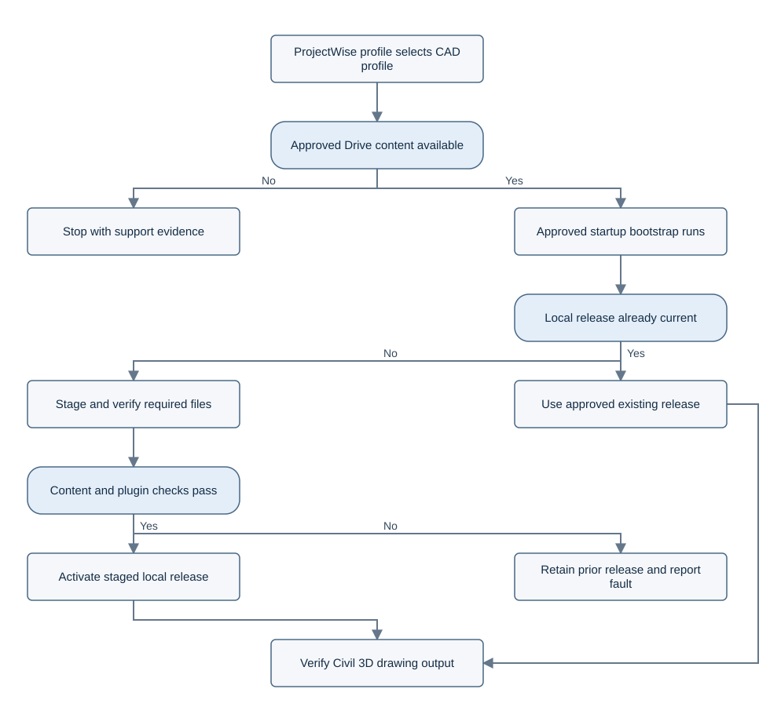

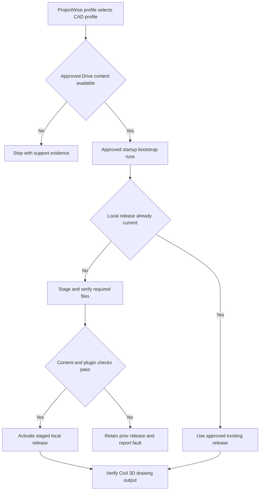
```mermaid
flowchart TD
    A["ProjectWise profile selects CAD profile"]
    B{"Approved Drive content available"}
    C["Stop with support evidence"]
    D["Approved startup bootstrap runs"]
    E{"Local release already current"}
    F["Stage and verify required files"]
    G["Use approved existing release"]
    H{"Content and plugin checks pass"}
    I["Activate staged local release"]
    J["Retain prior release and report fault"]
    K["Verify Civil 3D drawing output"]
    A --> B
    B -->|No| C
    B -->|Yes| D
    D --> E
    E -->|No| F
    E -->|Yes| G
    F --> H
    H -->|Yes| I
    H -->|No| J
    I --> K
    G --> K
```
